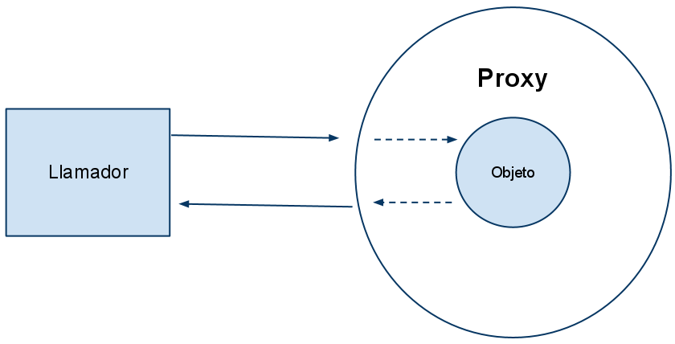
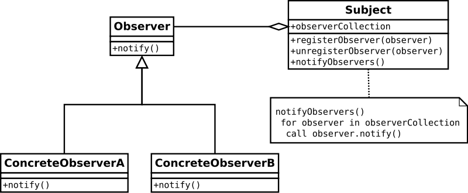
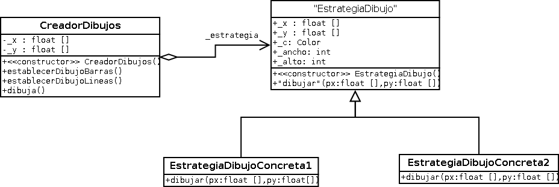
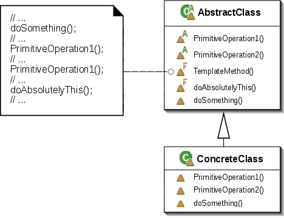

% Patrones de diseño
% Adolfo Sanz De Diego
% Junio de 2011

# Introducción

- Un patrón de diseño es una **solución a un problema** de diseño concreto.
- 1995 publicación del libro **Design Patterns**
- **Gang of Four** (GoF): Erich Gamma, Richard Helm, Ralph Johnson y John Vlisides

# Objetivos 

- Los patrones de diseño **pretenden**:
    - Proporcionar catálogos de elementos reusables en el diseño de sistemas software.
    - Evitar la reiteración en la búsqueda de soluciones a problemas ya conocidos y solucionados anteriormente.
    - Formalizar un vocabulario común entre diseñadores.
    - Estandarizar el modo en que se realiza el diseño.
    - Facilitar el aprendizaje de las nuevas generaciones de diseñadores condensando conocimiento ya existente.
- Asimismo, **no pretenden**:
    - Imponer ciertas alternativas de diseño frente a otras.
    - Eliminar la creatividad inherente al proceso de diseño.
- A continuación se mostrarán **algunos** patrones de diseño (no todos).

# De creación: Singleton

- Garantiza la existencia de una única instancia para una clase.

~~~~~~~~~~~~~~~~~~~~~~~~~~~~~~~~~~~~~~~~~~~~~~~~~~~~~~~~~~~~~~~~~~~~~~~~~~~~~~~~
public class Singleton {

    private static Singleton INSTANCE = new Singleton();

    // El constructor privado no permite que se genere un constructor por defecto
    private Singleton() {}

    public static Singleton getInstance() { return INSTANCE; }
}
~~~~~~~~~~~~~~~~~~~~~~~~~~~~~~~~~~~~~~~~~~~~~~~~~~~~~~~~~~~~~~~~~~~~~~~~~~~~~~~~

# De creación: Factory

- Una clase es la encargada de decidir que objeto crear dependiendo de algún parámetro.

# Estructurales: Decorator

- Nos permite no tener que crear sucesivas clases que hereden de la primera
incorporando una nueva funcionalidad, sino otras que la implementan
y se asocian a la primera.

# Estructurales: Adapter

- Su finalidad es transformar la interfaz de programación de una clase en otra.

# Estructurales: Proxy

- Un proxy hace de intermediario de otro objeto controlando su acceso
(carga remota, verifica permisos, tareas adicionales, etc.).

# De comportamiento: Observer

- La clase **Sujeto** contiene métodos mediante los cuales cualquier objeto **Observador**
puede suscribirse pasándole una referencia a sí mismo. El objeto sujeto guarda una
referencia de estos últimos a quienes notifica los cambios sucedidos.

# De comportamiento: Strategy

- Permite mantener un conjunto de algoritmos de entre los cuales
el objeto cliente puede elegir aquel que le conviene.

# De comportamiento: Template

- Define una serie de pasos en un método de la clase padre, pasos
que deberán ser definidos en las clases hijas.

# Los antipatrones

- Un antipatrón es una solución comúnmente usada que suele ser ineficiente y/o contraproducente.
- Un buen programador procurará **evitar los** siempre que sea posible.
- Lo anterior requiere su reconocimiento e identificación tan pronto como sea posible.

# Algunos antipatrones (I)

- **Acoplamiento secuencial** (sequential coupling): Construir una clase que necesita que sus métodos se invoquen en un orden determinado
- **Código espagueti** (spaghetti code): Construir sistemas cuya estructura es difícilmente comprensible.
- **Código ravioli** (ravioli code): Construir sistemas con multitud de objetos muy débilmente conectados.
- **Complejidad no indispensable** (accidental complexity): Dotar de complejidad innecesaria a una solución.
- **Números mágicos** (magic numbers): Incluir en los algoritmos números concretos sin explicación aparente.
- **Cadenas mágicas** (magic strings): Incluir cadenas de caracteres determinadas en el código fuente para hacer comparaciones.
- **Objeto todopoderoso** (god object): Concentrar demasiada funcionalidad en una única clase.

# Algunos antipatrones (II)

- **Desarrollo conducido por quien prueba** (tester driven development): Permitir que un proyecto software avance a base de extraer sus nuevos requisitos de los bugs.
- **Manejo de excepciones** (exception handling): Emplear el mecanismo de manejo de excepciones del lenguaje para implementar la lógica general del programa.
- **Manejo de excepciones inútil** (useless exception handling): Introducir condiciones para evitar que se produzcan excepciones en tiempo de ejecución, pero lanzar manualmente una excepción si dicha condición falla.
- **Ocultación de errores** (error hiding): Capturar un error antes de que se muestre al usuario, y reemplazarlo por un mensaje sin importancia o ningún mensaje en absoluto.
- **Programación por excepción** (coding by exception): Añadir trozos de código para tratar casos especiales a medida que se identifican.

# Algunos antipatrones (III)

- **Bala de plata** (silver bullet): Asumir que nuestra solución técnica favorita puede resolver cualquier problema.
- **Martillo de oro** (golden hammer): Asumir que nuestra solución favorita es universalmente aplicable, haciendo bueno el refrán a un martillo, todo son clavos.
- **Programación de copiar y pegar** (copy and paste programming): Programar copiando y pegando código.
- **Programación por permutación** (programming by permutation): Tratar de aproximarse a una solución modificando el código una y otra vez para ver si acaba por funcionar.
- **Reinventar la rueda** (reinventing the wheel): Enfrentarse a las situaciones buscando soluciones desde cero, sin tener en cuenta que puedan existir ya otras soluciones para afrontar los mismos problemas.
- **Reinventar la rueda cuadrada** (reinventing the square wheel): Crear una solución pobre cuando ya existe una buena.
