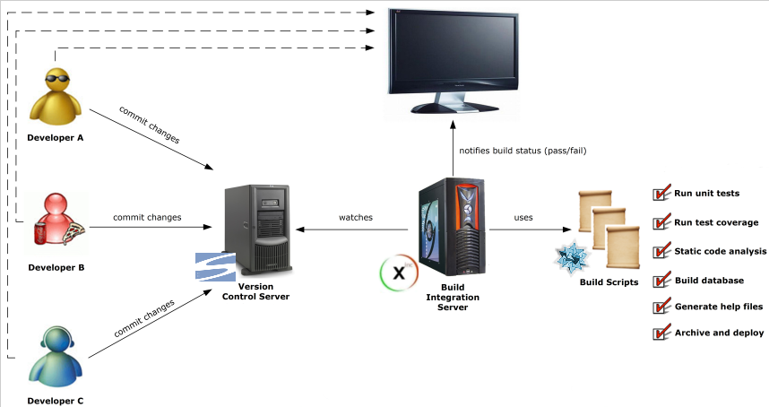

% Desarrollo aplicaciones mundo real
% Adolfo Sanz De Diego
% Junio de 2011

# Desarrollo en cascada

En **declive**.

Enfoque metodológico que ordena **rigurosamente** las etapas
del ciclo de vida del software, de tal forma que el inicio de cada etapa
debe esperar a la finalización de la inmediatamente anterior.

**Etapas**:
    1. Análisis de requisitos
    2. Diseño del Sistema
    3. Diseño del Programa
    4. Codificación
    5. Pruebas
    6. Implantación
    7. Mantenimiento

# Desarrollos ágiles

En **auge**.

Promueve **iteraciones** en el desarrollo a lo largo de todo el ciclo de vida del proyecto.

Cada iteración del ciclo de vida incluye: planificación, análisis, diseño, codificación, revisión y documentación.

Una iteración no debe agregar demasiada funcionalidad pues la meta es tener un demo (sin errores) al final de cada iteración.

Al final de cada iteración el equipo vuelve a evaluar las prioridades del proyecto.

Los métodos ágiles enfatizan las comunicaciones cara a cara en vez de la documentación.

Muy ligado con **TDD**.

# Control de versiones

Definición

-  Gestionan los diversos **cambios** que se realizan sobre el código.

-  Posibilitan el acceso al **histórico** de un determinado elemento o un conjunto de ellos,
    pudiendo normalmente volver a un estado anterior.

-  Facilitan la administración de las distintas **versiones** de cada producto desarrollado.

Funcionamiento

-  Disponen de un **repositorio**, que contiene el historial de todos los elementos.

-  Para trabajar, los usuarios se crean una copia local de la versión con la que quieren trabajar (**checkout**).

-  Cuando el usuario termina, sube los cambios de nuevo al repositorio (**commit**)

Ventajas

-  Control del código a lo largo del tiempo.

Tipos

-  **Centralizados**: existe un repositorio centralizado de todo el código,
    del cual es responsable un único usuario (o conjunto de ellos). 
    - Ejemplo: **Subversion**

-  **Distribuidos**: cada usuario tiene su propio repositorio.
    - Ejemplo: **Git**

# Construcción de proyectos: Ant

Herramienta **simple y multi-propósito** usada para la realización
de tareas mecánicas y repetitivas

Hecha en Java, tiene la ventaja de no depender de las órdenes del shell
de cada sistema operativo, sino que se basa en archivos de configuración XML
y clases Java para la realización de las distintas tareas,
siendo idónea como solución **multi-plataforma**.

Usada normalmente durante la fase de compilación y construcción de proyectos
de software.

# Construcción de proyectos: Maven

Herramienta de software para la **gestión y construcción de proyectos Java**.

Es capaz de gestionar **dependencias** entre proyectos.

Hay **plugins** para generar el JavaDoc, ejecutar los tests, lanzar métricas, etc.

Está pensado para usarse en red, para la gestión de dependencias y plugins.

El ciclo de vida de un proyecto Maven se divide en **metas**, de tal forma que
para ejecutar cualquier meta, todas las anteriores han debido ser completadas satisfactoriamente.

Las metas del ciclo de vida principal (existen otras) de un proyecto son:
    1. compile
    2. test
    3. package
    4. install
    5. deploy

# Métricas de código

Definición

-  Son un conjunto de **medidas de software** que proporcionan 
    una mejor visión del código que se está desarrollando.

Algunos tipos

-  Errores potenciales

-  Reglas de codificación

-  Número de comentarios

-  Número de líneas de código (por método, clase, paquete)

-  Complejidad ciclomática

-  Duplicidad del código

-  Cobertura de pruebas del código

-  Profundidad de las herencias de las clases

-  Acoplamiento de clases

-  etc.

# Herramientas de métricas de código

Herramientas (muchas tienen plugins para eclipse y/o maven)

-  **Checkstyle** (convenciones de codificación)

-  **PMD** (busca en el código ciertos patrones de error)

-  **Findbugs** (realiza análisis estático de código en busca de errores)

-  **JDepend** (proporciona métricas de cálidad entre los paquetes de un proyecto
    en términos de su extensibilidad, reusabilidad, y mantenibilidad.)

-  **JavaNCSS** (permite recoger métricas sobre el código fuente,
    como el número de líneas, paquetes, clases o métodos.)

-  **Cobertura** (permite calcular la cantidad de código al que acceden los tests)

Plataformas

-  **Sonar** integra todos las anteriores herramientas en una.

# Ventajas de las métricas de código

Cómo desarrollador:

-  Aprendes a **programar mejor**.

-  Aprendes a **detectar errores comunes**.

-  Aprendes **las reglas de codificación**.

-  **Cuantificas la calidad** de tú software.

Cómo docente:

-  Se pueden pasar métricas al código entregado por los alumnos
    para **corregir prácticas y exámenes automáticamente**.

# Integración Continua

Definición

-  Consiste en hacer **integraciones automáticas** de un proyecto
    lo más a menudo posible para así poder detectar fallos cuanto antes.

-  Cada cierto tiempo, o cada vez que se hace un commit:
        1. **descargarse las fuentes** desde el gestor de control de versiones,
        2. **compilar el código**,
        3. **ejecutar los tests**
        4. y **generar informes**.

Los servidores de Integración Continua más conocidos actualmente para Java son **Hudson y Jenkins**.

# Esquema Integración Continua

# Ventajas de la Integración Continua

Los desarrolladores pueden **detectar y solucionar problemas** de integración
de forma continua, evitando el caos de última hora cuando se acercan las fechas de entrega.

Disponibilidad constante de un **empaquetado** para pruebas, demos o lanzamientos anticipados.

Ejecución inmediata de los **tests unitarias**.

Monitorización continua de las **métricas de calidad** del proyecto.
