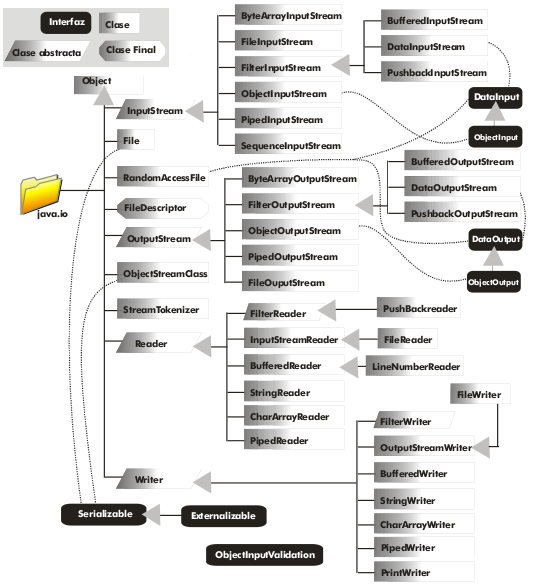

% Lectura y escritura de información estándar con Java
% Adolfo Sanz De Diego
% Junio de 2011

# Entrada/Salida en Java

Todas las clases relacionadas con la Entrada/Salida estén en el paquete **java.io**

Java lo que maneja en realidad son flujos, ya sean de **flujos de bytes o de caracteres**.

Los **flujos de entrada** son de entrada de datos del exterior hacia el sistema.

Los **flujos de salida** son de salida de datos del sistema hacia el exterior.

Esto se hizo así, de forma genérica, para poder **manejar igual** todos los flujos:
el de entrada/salida estándar (teclado y monitor), el de los ficheros o el de red, etc.

Las clases del paquete java.io implementan el **patrón Decorator**.

# Clases del paquete java.io

**InputStream/OutputStream**

-  **Clases abstractas** que definen las funciones básicas de lectura y escritura
    de un **flujo de bytes sin estructurar**.

**Reader/Writer**

-  **Clases abstractas** que definen las funciones básicas de lectura y escritura
    de un **flujo de caracteres**.

**InputStreamReader/OutputStreamWriter**

-  **Convierten flujos** de bytes en flujos de caracteres.

**DataInputStream/DataOutputStream**

-  Pensadas para trabajar con **datos primitivos** (int, long, double ...)

**ObjectInputStream/ObjectOutputStream**

-  Pensadas para trabajar con **objetos serializables**.

**FileInputStream/FileOutputStream**

-  Pensadas para trabajar con **archivos binarios**.

**FileReader/FileWriter**

-  Pensadas para trabajar con **archivos de texto**.

**BufferedInputStream/BufferedOutputStream**

-  **Decoradores** que añaden un **buffer** a los flujos de bytes.

**BufferedReader/BufferedWriter**

-  **Decoradores** que añaden un **buffer** a los flujos de caracteres.

**PrintWriter**

-  Posee los métodos **print y println** que otorgan gran potencia a la escritura.

# E/S estándar en Java

**System.in**

-  es un InputStream que representa la entrada estándar (normalmente el **teclado**) 

**System.out**

-  es un OutputStream que representa la salida estándar (normalmente la **pantalla**) 

**System.err**

-  es un OutputStream que representa la salida estándar para **errores**

# Ejemplo de E/S estándar

~~~~~~~~~~~~~~~~~~~~~~~~~~~~~~~~~~~~~~~~~~~~~~~~~~~~~~~~~~~~~~~~~~~~~~~~~~~~~~~~
String texto = "";
try{
    // Obtención del objeto InputStrem
    InputStream tecladoBytes = System.in;
    
    // Obtención del objeto Reader
    InputStreamReader tecladoCaracteres = new InputStreamReader(tecladoBytes);
    
    // Obtención del objeto BufferedReader
    BufferedReader tecladoTexto = new BufferedReader(tecladoCaracteres);
    
    // Lectura linea
    texto=tecladoTexto.readLine();
} catch(Exception e){
    System.out.println("Error"+e.toString());
}
// salida por pantalla
System.out.println(texto);
~~~~~~~~~~~~~~~~~~~~~~~~~~~~~~~~~~~~~~~~~~~~~~~~~~~~~~~~~~~~~~~~~~~~~~~~~~~~~~~~

# Sistemas de log

Permite sacar mensajes por pantalla o fichero en aplicaciones grandes.

El más conocido es **Log4J**, aunque desde Java 1.4 está el paquete **java.util.logging**.

Existe también **The Simple Logging Facade for Java or (SLF4J)** que es un 
wrapper que te permite usar de forma transparente distintos sistemas de log

Tienen un **fichero de configuración** en donde se indica el **nivel de trazas** 
para sacar por pantalla, para guardar en un fichero, o en general.

También se puede indicar distintos niveles de traza, para los *nombres de los logs*,
que se suelen usar los nombres de las clases donde se utiliza.

# Niveles de trazas

**OFF**: No se genera traza alguna.

**FATAL**: Se usa para trazar errores catastróficos,
que son aquellos de los que no hay recuperación posible.

**ERROR**: Se usa para trazar errores peligrosos,
para los que hay previsto un mecanismo de supervivencia.

**WARN**: Se usa para trazar errores sin peligro,
o posibles errores.

**INFO**: Trazas normales: para ir viendo lo que pasa.

**DEBUG**: Información de detalle,
típicamente útil para localizar errores (depuración).

**TRACE**: Información de más detalle,
 típicamente útil para localizar errores (depuración).

**ALL**: Se traza todo, a cualquier nivel. 

# Ejemplo con JCL

~~~~~~~~~~~~~~~~~~~~~~~~~~~~~~~~~~~~~~~~~~~~~~~~~~~~~~~~~~~~~~~~~~~~~~~~~~~~~~~~
import org.slf4j.Logger;
import org.slf4j.LoggerFactory;
...
private Logger log = LogFactory.getLog(this.getClass()); 
...
if ( log.isFatalEnabled() ) log.debug("error fatal");
if ( log.isErrorEnabled() ) log.error("error");
if ( log.isWarnEnabled() )  log.warn("atencion");
if ( log.isInfoEnabled() )  log.info("informacion");
if ( log.isDebugEnabled() ) log.debug("depurando");
if ( log.isTraceEnabled() ) log.trace("depurando mucho");
~~~~~~~~~~~~~~~~~~~~~~~~~~~~~~~~~~~~~~~~~~~~~~~~~~~~~~~~~~~~~~~~~~~~~~~~~~~~~~~~
