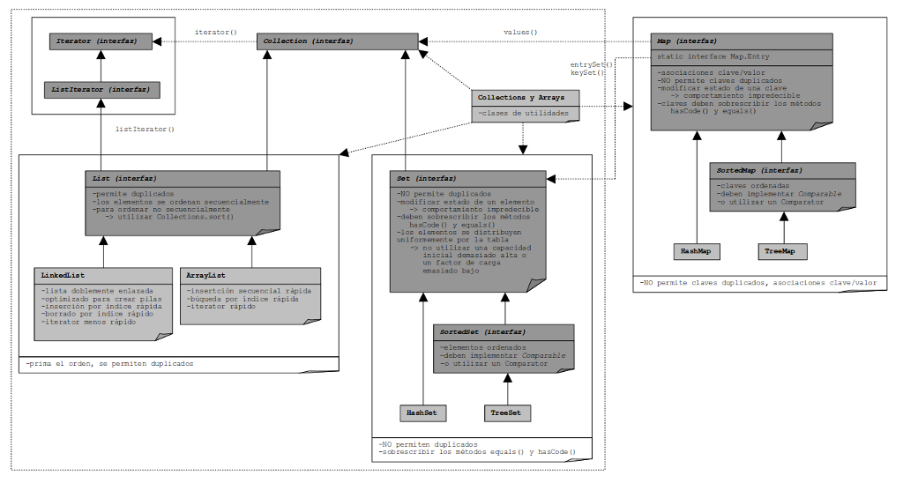

% Estructuras de datos en Java
% Adolfo Sanz De Diego
% Junio de 2011

# Introducción

- En Java existen las **matrices**.
- **Pero** existen todo un conjunto de clases que nos facilitan el trabajo:
    - Hasta la versión 1.1:
        - Existían las clases **Vector, Stack y Hashtable**
            - todos sus métodos están **sincronizados** -> implica rendimiento muchísimo menor
            - ahora para sincronizar -> utilizar **Collections.sincronizedX()**
    - Desde la versión 1.2:
        - **Iterator** -> para iterar
        - **Collection** -> contenedores de objetos
            - **List** -> prima orden, se permiten duplicados
            - **Set** -> no permiten duplicados (sobreescribir **equals() y hashCode()**)
        - **Map** -> asociaciones clave/valor
    - A parir de la versión 5.0:
        - **Genéricos** (parametrización)
        - **for-each** (Interfaz **Iterable**)

# Diagrama de clases

# Interfaz Iterator 

- Sirve para **iterar**.
- Todas las Collection tienen un **método .iterator()** que devuelve un Iterator.
- Funcionamiento:

~~~~~~~~~~~~~~~~~~~~~~~~~~~~~~~~~~~~~~~~~~~~~~~~~~~~~~~~~~~~~~~~~~~~~~
Iterator i = nombreVariableContenedor.iterator();
while (i.hasNext()) {
    Object o = i.next();
    ...
}
~~~~~~~~~~~~~~~~~~~~~~~~~~~~~~~~~~~~~~~~~~~~~~~~~~~~~~~~~~~~~~~~~~~~~~

# Interfaz Iterable

- Desde la versión 5.0 todas los contenedores implementan la **interfaz Iterable**.
- Nos sirve para iterar con el **for-each**.
- Funcionamiento:

~~~~~~~~~~~~~~~~~~~~~~~~~~~~~~~~~~~~~~~~~~~~~~~~~~~~~~~~~~~~~~~~~~~~~~
for (Object objetoIterado: nombreContenedorIterable) {
    ...
}
~~~~~~~~~~~~~~~~~~~~~~~~~~~~~~~~~~~~~~~~~~~~~~~~~~~~~~~~~~~~~~~~~~~~~~

# Interfaz Collection

- Define un **contenedor de objetos**, pero no comprueba que objetos introducimos.
- Es la interfaz de la que heredan todas las demás.
- Ejemplo:

~~~~~~~~~~~~~~~~~~~~~~~~~~~~~~~~~~~~~~~~~~~~~~~~~~~~~~~~~~~~~~~~~~~~~~
Collection coleccionDeObjetos = new ArrayList();
~~~~~~~~~~~~~~~~~~~~~~~~~~~~~~~~~~~~~~~~~~~~~~~~~~~~~~~~~~~~~~~~~~~~~~

- A partir de Java 5.0, con la llegada de los **genéricos**, podemos parametrizar los tipos de objetos.
- Ejemplo:

~~~~~~~~~~~~~~~~~~~~~~~~~~~~~~~~~~~~~~~~~~~~~~~~~~~~~~~~~~~~~~~~~~~~~~
Collection<String> coleccionDeCadenas = new ArrayList<String>();
~~~~~~~~~~~~~~~~~~~~~~~~~~~~~~~~~~~~~~~~~~~~~~~~~~~~~~~~~~~~~~~~~~~~~~

# Interfaz List

- **Permite duplicados**.
- Los elementos **se ordenan secuencialmente**.
- Para ordenar no secuencialmente -> utilizar Collections.sort()
- Sus 2 implementaciones más importantes:
    - **LinkedList**:
        - Lista doblemente enlazada, optimizado para crear pilas.
        - Inserción y borrado por indice rápida.
        - Iterador menos rápido.
    - **ArrayList**:
        - Inserción secuencial y búqueda por índice rápida.
        - Iterator rápido.

# Interfaz Set

- **NO permite duplicados**
- Si modificamos el estado de un elemento, su comportamiento es impredecible,
por lo que se recomienda utilizar **objetos inmutables** (no cambian su estado)
- Los objetos deberían sobrescribir los métodos **hasCode() y equals()**
    - Su implementación más importante es **HashSet**
    - Hereda de ella la Interfaz **SortedSet**:
        - Los elementos están **ordenados**, por ello:
            - hay que utilizar un **Comparator**.
            - o que los objetos implementen la interfaz **Comparable**.
        - Su implementación más importante es **TreeSet**

# Interfaz Map

- Define un contenedor de **asociaciones clave/valor**.
- **NO permite claves duplicados**
- Si modificamos el estado de una clave, su comportamiento es impredecible,
por lo que se recomienda utilizar **objetos inmutables** (no cambian su estado) para las claves.
- Los claves deberían sobrescribir los métodos **hasCode() y equals()**
    - Su implementación más importante es **HashMap**
    - Hereda de ella la Interfaz **SortedMap**:
        - Las claves están **ordenadas**, por ello:
            - hay que utilizar un **Comparator**.
            - o que las claves implementen la interfaz **Comparable**.
        - Su implementación más importante es **TreeMap**

# Comparable y Compararator

- Los objetos que implementen **Comparable** tienen que implementar el método:
    - int compareTo(Object o)
- Los objetos que implementen **Compararator** tienen que implementar el método:
    - int compare(Object o1, Object o2)
    - boolean equals(Object o) 
- Los métodos **compareTo()** y **compare()** devuelven:
    - un int <0 si menor
    - un int =0 si igual
    - un int >0 si mayor
- Los métodos **compareTo()** y **compare()** deberían de ser consistentes
con el método **equals()**

# boolean equals(Object o)

- Cuando sobreescribimos la función **equals()** tenemos que tener en cuenta que:
    - a.equals(a) == true
    - a.equals(b) == b.equals(a)
    - a.equals(b) == b.equals(c) == true -> implica a.equals(c) == true
    - a == b -> implica a.equals(b) == true
    - b == null -> implica a.equals(b) == false

# int hashCode()

- Se utiliza como **índice**. 
- Sobrescribir el método equals() -> implica sobrescribir el método hashCode() 
    - a.equals(b) == true -> implica a.hashCode() == b.hashCode() 
    - pero a.hashCode() == b.hashCode() -> NO implica a.equals(b) == true 
- Su cálculo ha de ser rápido.
- Los valores devueltos deben de ser uniformemente distribuidos.

# Otras características

- Los objetos de tipo Collection o Map son contenedores,
que a diferencia de las matrices, incrementan su capacidad cuando lo necesitan.
- **loadFactor** = size / capacity
- Si size > loadFactor
    - -> se incrementa la capacidad
    - -> se crea una nueva estructura de datos
    - -> se copia los elementos de una a otra
- Para evitar ampliaciones sucesivas **initialCapacity**
debería ser lo más cercano al tamaño esperado.
- Las clases **Collections** y **Arrays** son clases de utilidades.

